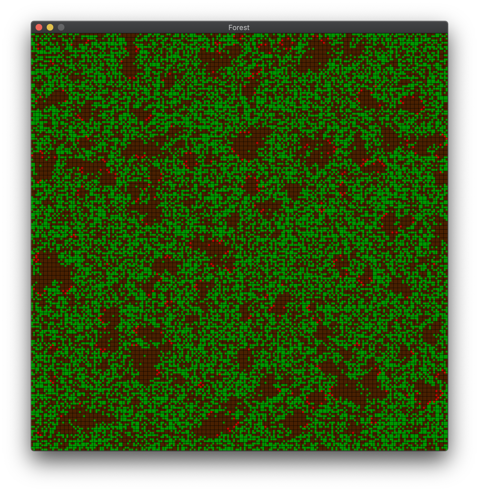

# **Forest** - *a green cellular automata*

The purpose of this project is to implement a cellular automata in C++, using parallel computing and the MPI library to improve performances. Allegro5 is the library used for the GUI. This project was developed for "Algoritmi Paralleli e Sistemi Distribuiti" course, at Università della Calabria, AA 2019/2020.

A cellular automata is a mathematical model, consisting in a finite *n*-dimensional matrix of cells, each in one of a finite number of states.  
They are used to represent the global evolution of complex systems, which depend on local rules only, such as the ideal gas behavior, the evolution of a population or an ecosystem, and being used in fields such as biology, physics and statistics.

Forest is a bidimensional cellular automata, which simulates the propagation of a fire in a forest. 
The states of a cell are:
- *living tree*, represented by the color green;
- *burning tree*, represented by the color red;
- *ground*, represented by the color brown.

A living tree can be hit by a lightning and catch fire with a probability of *1/L*; a tree can grow on ground with a probability of *1/G*.  
The default values of these constants are *L*=2000, *G*=200, however they can be changed in the source code. The matrix size can be changed as well.

A living tree becomes a burning tree if one of its four neighbors is burning. A burning tree becomes ground in the next round.

---
## serialForest.cpp
The CA is represented by a matrix, which is allocated dynamically, initially filled with random values. However, two matrices are needed to represent the current and next step, and since deallocation and reallocation are expensive operations, the matrix containing the previous state is overwritten with the next state. The boolean *whatMatrix* indicates which is the current state.

The serial implementation was needed to understand what's the best choice for parallelization design and implementation. Moreover, this implementation was used to measure times, to be compared with the parallel implementations.

---
## parallelForest.cpp
MPI is a communication protocol for distributed systems, based on message passing. Both point-to-point and collective communication are supported, and this project uses both of them.

The great difference between the serial and parallel is how the matrix is computed: the root process, which has the initial random-filled matrix, sends a different portion of the rows of this matrix to each process. Like the serial version, processes have two sub-matrices, for the current and next state.  
Since the state of a cell is based on all the neighbors, all the processes send their first row to the previous process, and the last row to the next process. Then they proceed with the computation of the new matrix.
At the end of the computation phase, the root process receives all the computed rows in a gather operation, in which the matrix is filled with the values coming from the other processes. The root process then proceeds to draw the matrix.  
Scatter is the operation of splitting and sending data to the various processes. This is done by the root process only at the start of the application with the first random-generated matrix: after the computation, all the processes have the current state and can compute the next state without having to receive any data from the root process. This operation could have been avoided by letting the processes fill their matrix with random values by themselves, however a gather operation would be needed for the first drawing of the matrix, and this operation is more expensive than a scatter.

---
## groupForest.cpp
MPI provides advanced communication features, including groups of processes. An example is the default communication group, MPI_COMM_WORLD, which contains all the processes assigned by the operating system, and the developer can create subgroups of it to handle different operations.

The purpose of this implementation is to make the user aware of the potential of the parallel computing by showing and computing two cellular automatas at the same time, using two groups. The user can choose which processes are part of the first group, and two root processes will manage and draw the two different automatas in two different windows.  
After every round, the user can see the computing time of each group. If the groups have different number of processes, then the times will vary accordingly.
